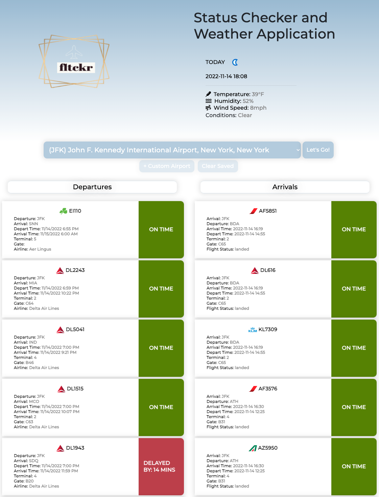

# 🛩️ Travel Status Checker

## 💡 Description
Created a status board that presents the user with real time flight status information for the ten most popular airports in the United States. 
 
The board allows the user to choose their airport from a drop-down.
The user is presented with the flight number,date/weather/arrival/departure status/terminal and gate information for 20 upcoming departures and 20 arrivals.
 
## 🤖 Technology
The webpage was designed utilizing Bootstrap,fontawesome, CSS and javascript.
 
We utilized 3 API's from aviationstack.com, airlabs.com, weatherapi.com. From airlabs.com we utilized two endpoints: /airports to retrieve geolocation and airport details; /schedules to pull back arrivals data. We used the schedules/endpoint to pull departures data. 
 

## 🔗 Links

[Deployed Application](https://samvillafana.github.io/JFK-TRAVEL-CHECKER/#reload)

## 📸 Screenshot

## 📝 Credits
- Airport API - Courtest of [Aviation Stack](https://aviationstack.com/)
- Flight Departures API - Courtesy of [Aviation Edge](https://aviation-edge.com/)
- Flight Arrivals API- Courtesy of [Airlabs](https://www.airlabs.com/)
- Weather API - Courtesy of [Weather API](https://www.weatherapi.com/)
- Font - Courtesy of [Google Fonts.](https://fonts.google.com)
- Fontend Toolkit - Courtesy of [Bootstrap.](https://getbootstrap.com/)

## 👥 Contributors
- Alina Garcia [Github](https://github.com/garcia0216)
- Jerry Davis [Github](https://github.com/davisj33ry)
- Samuel Villafana [Github](https://github.com/samvillafana)
- Steven McCombe  [Github](https://github.com/Steven-McCombe)

## 🪪 License
MIT license